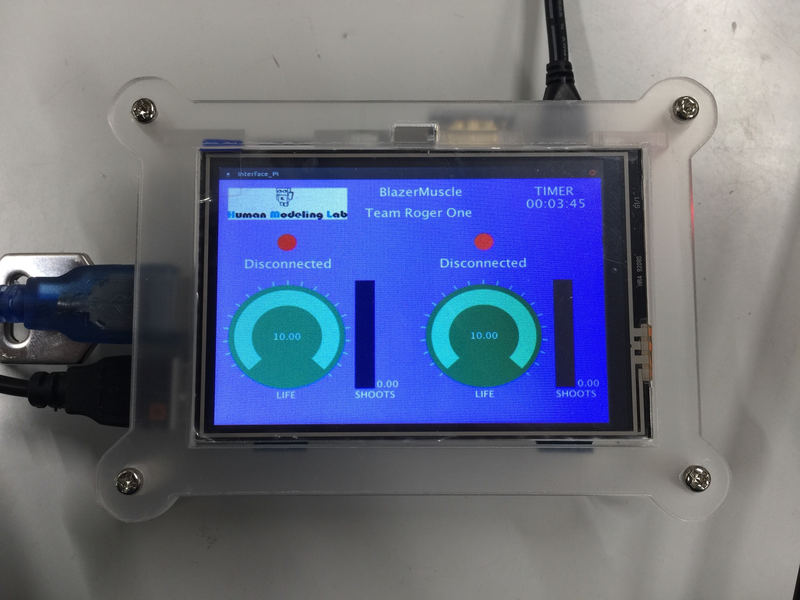
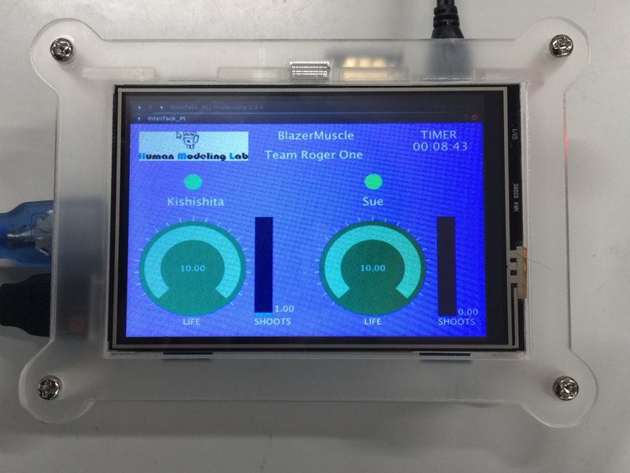
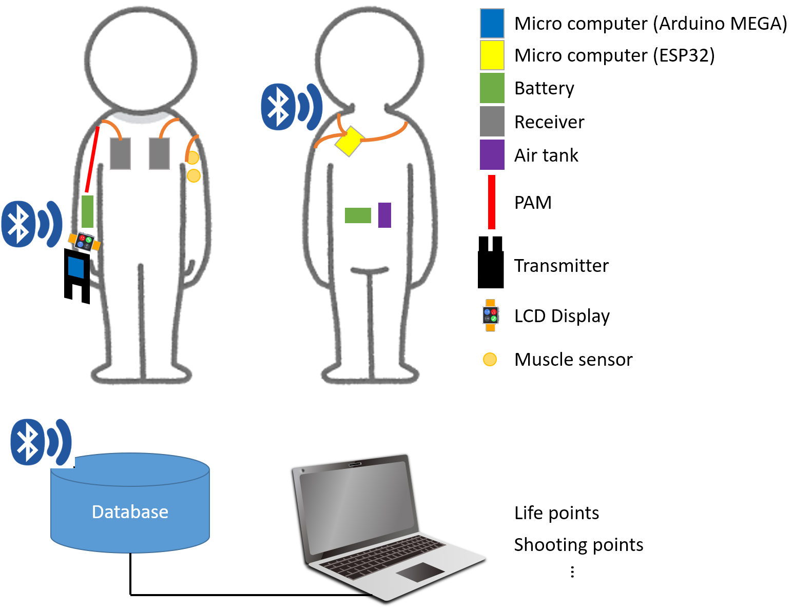
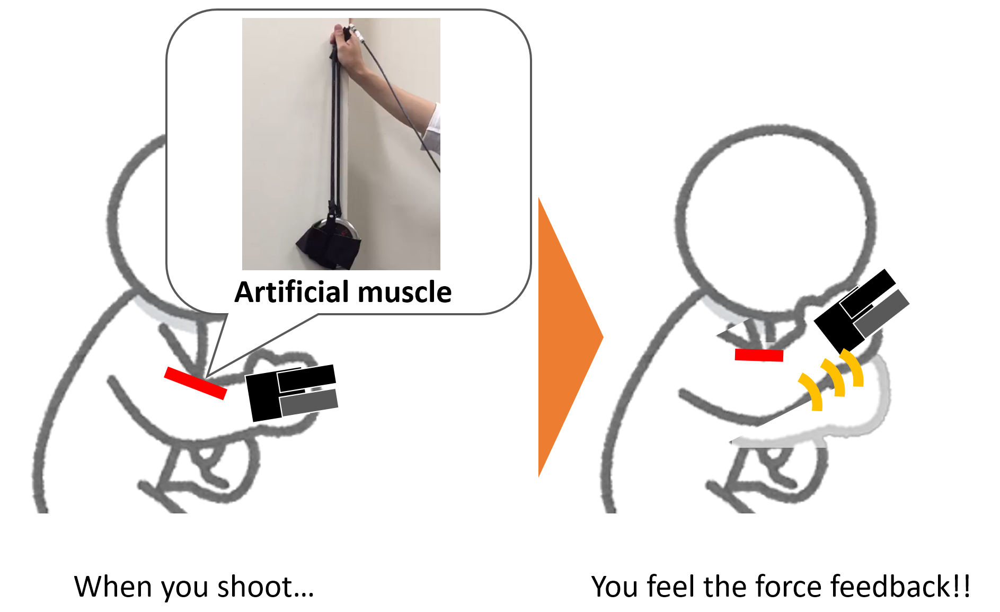
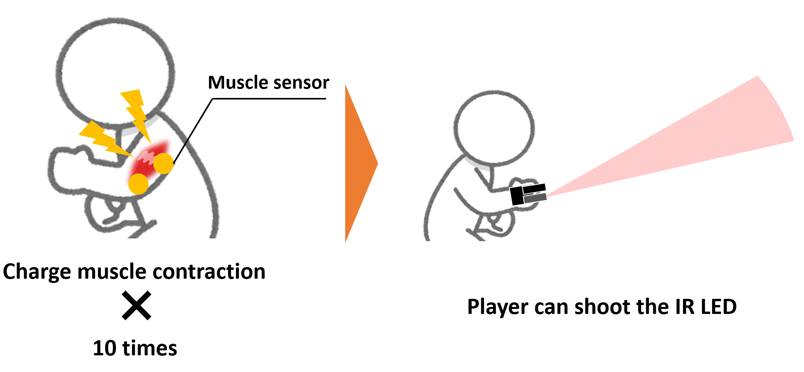

# Super Human Game

Physical activities are highly significant in maintaining a healthy life. However, with increased dependency on automated systems, our lifestyle is becoming more and more desk-bound, making us prone to multiple health-related difficulties such as cardiovascular diseases, diabetes, and cancers. To tackle such issues, we must introduce innovative ideas for integrating technology with exercise techniques that can implement sports, fun, and physical stimulation. Our team proposes a paintball game by integrating multiple ideas of human-augmentation. The players are divided into two equal-numbered teams. Each player has a laser gun attached to their right forearm. The laser gun is accompanied by a set of pneumatic artificial muscles to provide a feeling of force-feedback to the user. Players will have a special weapon, an infrared (IR) gun with a broader range, that can be used to target opposite players, effortlessly. On the players' left arm; an electromyographic sensor is attached. This sensor is used as a charging device, to be able to use the IR gun. All players can track their progress on a visual interface attached to their right arm. This game can be played by all individuals irrespective of their age, and provide new value of the sports.

### The instructions to Setup the game are written for MacOS High Sierra, Windows and Linux users.

##### Interface of the game in Raspberry PI 3

## Rules

### General Rules

The dynamic of the game is almost the same as in paintball.

### Player rules

- Each player has 10 points as "lives"
- Each player has 30 shoots
- If you received one impact by laser it will count as -1 point
- If you received one impact by super weapon it will count as -5 points
- Each shoot of laser and IR count has 1
- When the life counter is 0 **_Game Over_**.
- When the shoot counter is 30 **_Game Over_**.

### Weapons Impacts

Weapon | Impact
:----: | :----:
Laser  |   1
  IR   |   5

### Weapons shoots

Weapon | Shoot
:----: | :---:
Laser  |   1
  IR   |   1

#### NOTE you must charge the muscle power to shoot the Special weapon

### Time

10 minutes or enemy team down.

## System Overview

### Transmitter

### Force-feedback

### Special weapon

## Contributing

Please read [CONTRIBUTING.md](https://github.com/totovr/Processing/blob/master/CONTRIBUTING.md) for details of the code of conduct, and the process for submitting pull requests to us.

## Versioning

I use [SemVer](http://semver.org/) for versioning.

## Authors

Antonio Vega Ramirez:

- [Github](https://github.com/totovr)
- [Twitter](https://twitter.com/SpainDice)

Yusuke Kishishita:

- [Github](https://github.com/bigface0202)

Swagata Das:

- [Github](https://github.com/sdswoops824)

Chetan Thakur

Yuichi Kurita

- [Official page](http://www.bsys.hiroshima-u.ac.jp/~kurita/cal.html)

## License

This project is licensed under creative commons Licence (cc) - see the [LICENSE.md](https://github.com/totovr/SuperHuman/blob/master/LICENCE.md) file for details

## Future task

#### Special game

- [ ] Flag battle, the team have to take the enemy flag to win."
- [ ] Blind battle, each player will not be able to use his/her ***view***. To support the user in the game he/her will use and GridEye (infrared sensor) and an ultrasonic sensor to find the enemy players. ***Use only IR LED weapon.***
